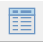

---
---
---

# Exercise 1: User interface of QGIS

**Exercise content**

This exercise acquaints you to the user interface and basic features of QGIS.

**The goal of the exercise**

After this exercise you know how to use the QGIS user interface.

**Preparations**

Open a website and navigate to the QGIS website

::: note-box
<http://www.qgis.org/fi/site/>
:::

On the main page you'll find a link where you can download QGIS. Download the latest QGIS Long Term Release (LTR). The long term release is the most stable QGIS version, but may lack the newest features. QGIS can be installed on Windows, Linux or Mac operating systems. The differences in QGIS between operating systems is mainly visual and with file paths.

## Downloading course materials

Datasets used during the course can be downloaded from Google Drive following this link:

::: note-box
[course_directory.zip](https://drive.google.com/file/d/1IAdDFktqd7_KoNBAITfyY9WztCME9Ckm/view?usp=share_link)
:::

Open the link above and click **Download**. The data directory is compressed as a .zip- file **course_directory.zip**. Extract the data directory a suitable location on your computer. The directory should be easily found during the exercises. In the following exercises a reference to **../course_directory/** means the file path chosen by you. Ask for instructions if needed.

## QGIS user interface

Start QGIS. The QGIS user interface may open in a local language different language from English. You can change the language from **Settings → Options → General**, Click **Override System Locale** → **User Interface Translation → American English**. Finally press **OK**.

{width="693"}

In order for the language change to take effect you have to restart QGIS. Add the first vector dataset by clicking **Open Data Source Manager**: The same tool can be found in the Layer- menu **Add layer -\> Add Vector Layer** (Ctrl+Shift+V). A new window should open. Choose the **Vector- tab** on the left. Add a dataset from the data directory (**..course_directory/geofabrik/**). Choose the **berlin_roads.shp** file. Finally, click the **Add** button and close the window.  The dataset should show up as follows (the color might be different):

The QGIS user interface

#### **1. Toolbars**

As the name suggests, **Toolbars** include sets of different tools. Your QGIS might have a different number of toolbars compared to the screenshot above. You can hide or view different toolbars by right clicking the toolbar section. You can also drag toolbars to different locations on the screen.

#### **2. Map View**

The **Map View** displays the geographic data sets that are set visible in the **Layers Panel**. You can zoom in and out and pan the map with you mouse (Also try the scroll wheel on your mouse, use CTRL + scroll for more subtle zooming).

#### **3. Browser Panel**

We already used the **Browser Panel** briefly. In this panel you can find different file paths and navigate to your data.

#### **4. Layers Panel**

The **Layers Panel** displays the data you have added into your project. One set of data is referred to as a **Layer**, so currently we have one layer in our project. In this panel you can for example switch the drawing order of the layers or set them to be included or not included in the **Map View**. 

#### **5. Search**

With the **Search** functionality you can easily find different tools and functionalities.

#### **6. Status Bar**

In the **Status Bar** you can find the **coordinates** of your mouse cursor (either in meters or in latitude and longitude), the **scale**, the **magnifier**, the **rotation**, the **coordinate reference system** and QGIS's log **messages**. The status bar is handy for example when you need to quickly change the coordinate reference system of the project.

## Try the tools yourself

Try at least the following tools in the **Map Navigation Toolbar** and in the **Attributes Toolbar**:

Locate these tools from the aforementioned toolbars and recognize their functions:

+--------------------------------+--------------------------------------------+
| ##### **Zoom Full**            |              |
+--------------------------------+--------------------------------------------+
| ##### **Zoom to Layer**        |              |
+--------------------------------+--------------------------------------------+
| ##### **Identify Features**    | {width="36"} |
+--------------------------------+--------------------------------------------+
| ##### **Open Attribute Table** | {width="42"} |
+--------------------------------+--------------------------------------------+
| ##### **Measure Line Length**  |              |
+--------------------------------+--------------------------------------------+

\
Also try the functionalities of the **Status Bar** and the **Layers Panel**.

Try the functionalities in the Layers Panel:

## Attribute table

Choose the **berlin_roads** map layer and open its Attribute Table. You can do this by clicking the icon  or by right clicking with the mouse over the layer and choosing **Open Attribute Table**. You can order the table by any of its fields in to either ascending or descending order.

When you've inspected the Attribute Table enough, close the table window.

Finally save the QGIS project in to your data directory and name it **../course_directory/QGIS_exercise_1.qgz**.

::: hint-box
**Psst! Always save your project file at the end of the exercise.**
:::
