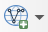

# Exercise 2: Geographic data and online data services

## Exercise content

In this exercise you will add different geographic datasets and connections to online data services in QGIS.

## The goal of the exercise

After this exercise you know how to add geographic data and connect to online data services in QGIS.

## Preparations

Open the project used in the previous exercise and save it as (**Project -\> Save As**) "**QGIS_exercise_2**".

::: hint-box
**Psst! Remember to save the project consistently during the exercises.**
:::

## Connecting to a WMS

First we will connect to a **WMS** (Web Map Service). Through this WMS connection we will add our first **raster** data to our project. Open the **Data Source Manager** and choose the **WMS/WMTS** tab.

A window for defining and using WMS resources opens. Your QGIS might already have some predefined WMS resources. You can find them in the drop-down menu at the top of the window. Let's add a new  WMS resource by clicking **New**. The **Create a New WMS/WMTS Connection** dialog box is now open. Let's first type a name for our new WMS resource in the **Name** field.

::: hint-box
Psst! Give online data resources informative name, for example based on the data provider. You could name this WMS as NASA, as we will be connecting to a WMS that hosts their earth observation data.
:::

Copy the address of the WMS ([https://neo.gsfc.nasa.gov/wms/wms?version=1.1.0)](https://neo.gsfc.nasa.gov/wms/wms?version=1.1.0) to the URL field. Some data resources might require a sign in to the service, but when the data is open credentials are rarely needed. For this WMS you can leave **No Authentication** selected.

Once you have set the connection details, press **OK**. In the **Data Source Manager** press **Connect**. QGIS will now connect to the online data resource, and after a short wait a list of the available data appears. Notice that the list has subcategories. In the future QGIS will remember saved connections.

Let's add a WMS layer depicting land surface temperatures. First, make the **Title** column wider by dragging the line between it and the **Abstract** column. This way you can read the titles and navigate the data efficiently. Once you can see the titles, select **Average Land Surface Temperature [Day] \> Average Land Surface temperature [DAY] (1 month)** **\>** **RGB Style**.

RGB style means that the layer is drawn in color, but it is not the most descriptive layer name to use in the project. You can specify a custom name for the data in the **Layer name** field. Finally, press **Add**, and QGIS adds the layer to the project.

There might be a slight delay while the data is downloaded from the server. You can now close the **Data Source Manager** and return to the map view. A colored raster map with information about land surface temperatures should be visible.

You can now add more WMS resources. Feel free to experiment with the below examples of international WMS resources:

-   **Bathymetry and topography data by GEBCO**:\
    <https://www.gebco.net/data_and_products/gebco_web_services/web_map_service/mapserv>

-   **OpenStreetMap as a WMS by Terrestris\
    **<http://ows.terrestris.de/osm-gray/service>

-   **Drought frequency change in europe by European Environment Agency**:\
    <https://climate.discomap.eea.europa.eu/arcgis/services/ClimateChange/Drought_Frequency_change/MapServer/WmsServer>

-   **High resolution satellite imagery of europe by European Environment Agency (the image layer might take a while to load and display due to size):\
    <https://image.discomap.eea.europa.eu/arcgis/services/GioLand/Core01Cov2_2012/MapServer/WmsServer>**

You can navigate between different WMS resources in the **Data Source Manager**. Simply select the **WMS** tab and choose the service you want to connect to from the drop-down menu.

Once you have chosen a WMS resource that you want to connect to, remember to click **Connect** right below the drop-down menu. WMS data is not loaded to QGIS just by selecting the server, you need to connect to the server too. 

## Connecting to a WFS

Next we will connect to a **WFS** (Web Feature Service). WFS resources are used to get **vector** data to QGIS. Connecting to a WFS happens much like connecting to a WMS: the only difference is that instead of the **WMS/WMTS** tabyou have to choose the **WFS** tab in the **Data Source Manager**. So, let's open up the **Data Source Manager** and select the **WFS** tab(or click the **Add WFS Layer**  icon from the **Manage Layers Toolbar**) .

::: hint-box
Psst! When using a WFS you can either download whole data sets or just parts of them. Selecting which parts to download is done with different queries.
:::

As an example, use this URL (<https://mrdata.usgs.gov/wfs/hi>) to connect to a WFS that hosts a geological map of Hawaii. This open service and data is provided by USGS (United States Geological Survey). If you are curious you can also search the internet for other WFS resources (Your local data providers most likely have some, for example).

Once you have added the details of the new WFS connection to QGIS, you can connect to it the same way we connected to a WMS. When you are connected, try adding Hawaii's geologic map to the project (the name of the map layer in the WFS is **ms:units**). Notice how, instead of a raster image, vector polygons are being loaded to your project. Downloading the whole data set takes a while, so be prepared to wait for about 10-20 seconds. If you want to edit the data you have downloaded from a WFS, you have to save the data locally on your own computer.

## Bonus: Building SQL query for WFS

You can filter datasets using a SQL query in QGIS. This functionality is found in the same window where WFS- connections are added. First add a new connection to a GNS Science (New Zealand Research Institute) WFS:

::: note-box
<https://maps.gns.cri.nz/gns/wfs>
:::

Search for the **geol_units** layer. We can then filter the features by area with an SQL query. In the next animation this is demonstrated:

::: hint-box
**Psst! Always save your project file at the end of the exercise.**
:::
