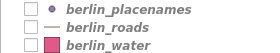
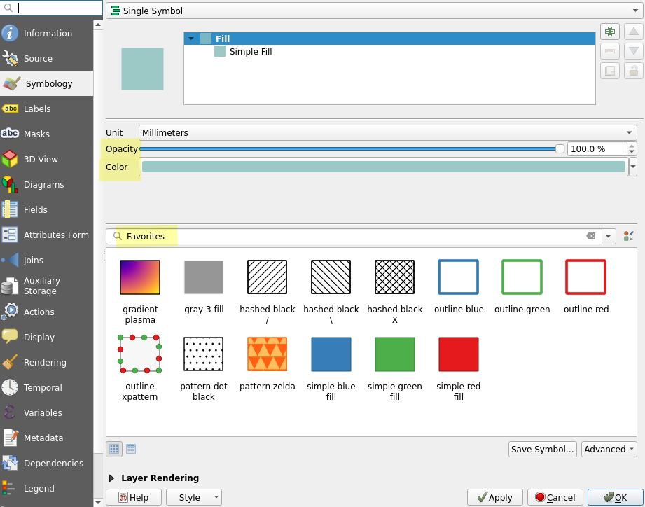
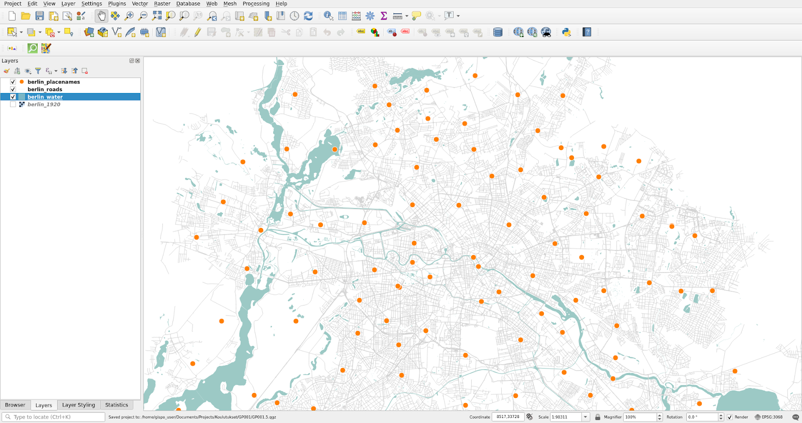
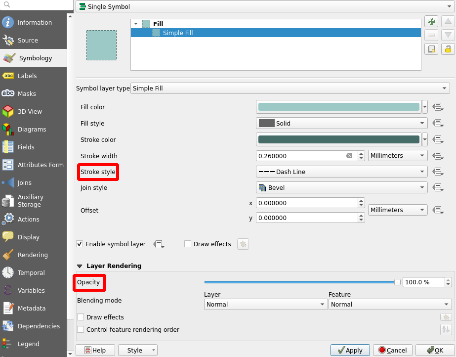
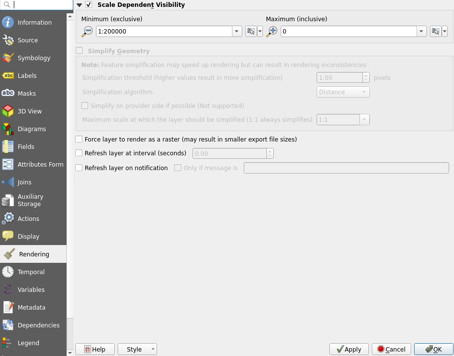

# Exercise 3: Visualizing and classifying geographic data sets

## Exercise content

This exercise familiarizes you with visualization techniques for vector data.

## The goal of the exercise

After this exercise you know how to use basic visualization tools for different data sets.

## Preparations

Open a new QGIS project (Project \> New) and save it as "QGIS-exercise 3". Add the following data to the project:

-   **..course_directory/geofabrik/berlin_placenames.shp**
-   **..course_directory/geofabrik/berlin_roads.shp**
-   **..course_directory/geofabrik/berlin_water.shp**

## Visualizing vector data

Take a look at all the vector data sets that are currently open in your project. You will notice that on the left side of each layer there is a shape that describes its vector type. **berlin_placenames** is a **point** data set, **berlin_roads** is a **line** data set and **berlin_water** is a **polygon** data set.

## Visualizing line data sets

In the **Layers Panel**, set the **berlin_roads** layer visible and hide all other layers. Right click the **berlin_roads_layer** in the same panel. Navigate to the layer's **Properties** and select the **Symbology** tab like we did with the raster data set earlier. Note that the properties of a vector layer are more complex than those of a raster layer. The **Symbology** tab is completely different as well.

Specify the **width** and **color** of the **berlin_roads** layerand press **Apply** to update the map view with your changes. Now, select a line style library, **Favorites** for example, and change the line style to one of the options. Once done, press **OK** to close the window and view **berlin_roads** visualized with your symbology settings.

The visualization of other geographic data sets follows the same pattern: **Right click**ing the layer, selecting **Properties...** and then the **Symbology** tab. Different types of vector layers (points, lines, polygons) have different symbology properties. Although the appearance of the symbology tab is quite similar when working with vector data, you cannot style a line layer with the exactly same symbology settings you used for a point layer, for example.

## Visualizing point data sets

Let's visualize point data next. Set the **berlin_placenames** and **berlin_roads** layers visible and keep other layers hidden. The placenames layer has Berlin's place names as points (data from OpenStreetMap / Geofabrik). Open the layer's **Symbology** tab just like before and notice the differences between the properties of line and point layers. Select a new **Color** and **Size** for the symboland press **Apply**. Change the symbol itself as well and try how rotation affects the appearance of the symbols.

Your point and line data sets together could look something like this, for example:

## Visualizing polygon data sets

Let's move on to polygons. Set the **berlin_water** layer visible together with the **berlin_roads** and **berlin_placenames** layers and hide all other layers. Open the symbology tab of the **berlin_water** layer and note the differences to the properties of the previous point and line data sets. Experiment with **colors** and selecta different **symbol** for the layer. Feel free to try different **opacity** values as well. Once you have tinkered enough, press **OK**.

It is possible that your layers overlap in such a way that for example some of your points are left invisible underneath the water polygons. You can fix this by editing the layer order: simply drag the layers into your desired order in the **Layers Panel**. It is often best to leave polygon data sets at the bottom. Same goes for raster data. Your rearranged vector layers should look something like this:

## Changing symbols

Next we will change the symbols of the polygons. Open the properties of the **berlin_water** layer again and from the **Symbology** tab select the **Simple Fill** line:

Now set **Stroke style** to **Dash Line**. You can also set the **Stroke width** to your liking. Finally, set the **Opacity** to 70%(From the **Layer Rendering** settings).

## Scale dependent symbols

Next we will set a scale limit for the **berlin_placenames** layer. Select the layer's **Properties \> Rendering** and check the box **Scale Dependent Visibility**. Then set the **Minimum** to 1:200 000. With this setting the place name layer is visible only when the scale is larger than 1:200 000.

Enable your changes by pressing either **Apply** or **OK**. The latter closes the **Properties** window in addition to enabling your changes. Now try zooming the map view and see how the layer vanishes once you zoom out far enough. You can change the scale of the map either by scrolling with the mouse or by typing the desired scale into the scale section of the **Status Bar** at the bottom of the screen.

::: hint-box
Psst! Check the coordinate reference system (CRS) from the bottom right of the screen! The CRS of the project should be EPSG:3068. All data in this exercise is already in EPSG:3068, so QGIS has most likely automatically set the correct project CRS.
:::

 
