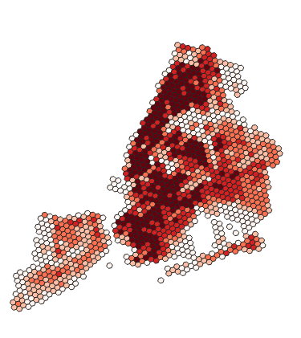
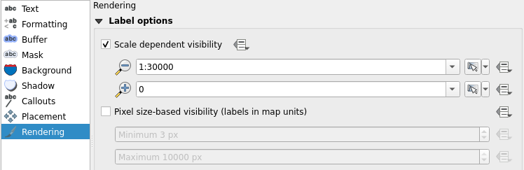

# Exercise 4: Labeling and classifying geographic data

## Exercise content

This exercise familiarizes you to labeling and classifying data sets.

## The goal of the exercise

After this exercise you can create labels for different datasets and classify data with QGIS.

## Preparations

Open a new QGIS project (Project \> New) and save it as "QGIS-exercise 4". Add the following data to the project:

-   **..course_directory/geofabrik/berlin_placenames.shp**

-   **..course_directory/geofabrik/berlin_roads.shp**

-   **..course_directory/geofabrik/berlin_water.shp**

-   **..course_directory/kontur/population_ny.gpkg**

-   **..course_directory/copernicus/DEM_greece.tif**

In QGIS, it is possible to add labels to your map features. Open the **Properties** of the layer **berlin_placenames**. Choose **Single Labels** and from the drop-down menu below select the field that contains the name information (**name**).Press **Apply** and the labels appear in the map view.

## Label settings

There are many ways to further customize how our labels appear on the map. Below are short descriptions of the ways labels can be customized in QGIS:

+----------------------+------------------------------------------------------------------------------------------+
| ##### **Text**       | General text settings: the font,  color, and size of text, for example                   |
+----------------------+------------------------------------------------------------------------------------------+
| ##### **Formatting** | You can form multiline texts, center your labels and format numbers.                     |
+----------------------+------------------------------------------------------------------------------------------+
| ##### **Buffer**     | You can highlight your labels by generating buffers around them.                         |
+----------------------+------------------------------------------------------------------------------------------+
| ##### **Background** | You can draw a shape to act as a background behind the text.                             |
+----------------------+------------------------------------------------------------------------------------------+
| ##### **Shadow**     | You can generate a shadow for the text.                                                  |
+----------------------+------------------------------------------------------------------------------------------+
| ##### **Placement**  | Settings related to text basement in relation to the map feature                         |
+----------------------+------------------------------------------------------------------------------------------+
| ##### **Rendering**  | You can configure scale limits and other settings related to the visibility of the texts |
+----------------------+------------------------------------------------------------------------------------------+

## Styling label texts

You can specify the font,  color, and size of your label texts. Try different text styles and experiment with adding shadows to the labels. Adding shadows can help the map viewer distinguish the labels from other map features. Select the **Shadow** tab and check the **Draw drop shadow** box. Press **Apply** to see your changes. Try editing the **Offset**, **Blur radius**, **Opacity**, and **Color** settings too. You can see the effects on the map or in the **Sample text** field**.**

Buffers are another useful tool for highlighting texts. Select the **Buffer** tab and configure a buffer you like by checking the font,  color, and size of text **Draw text buffer** box. Try different **colors** and **sizes** and change the **opacity** too.

Now open the **Placement** tab. The default setting should be **Around Point**, which means QGIS automatically finds a spot around the map feature where the label fits. Try choosing **Offset from Point**. Notice that all labels are now drawn strictly at the same position in relation to the map features. From the **Quadrant** selector, select the top middle quadrant and press **OK**. Notice how all labels are now horizontally centered.

The result might seem a bit cluttered, especially if your map view is zoomed out. Zoom a bit closer so the labels are clearly visible and think about other possible cases where adding labels to a map would make sense. Navigate back to the **Placement** tab and scroll down to **Priority**. Set it to high in order to have the labels always appear on top of other map features and their labels. This way you can set the order in which you want the labels of different layers to appear on the map. Press **OK**.

::: hint-box
Psst! When dealing with polygon features, a useful way to limit the amount of labels is to set labels only for features above a certain size threshold. This can be done by selecting Rendering \> Suppress labeling of features smaller than
:::

## Labeling line layers

Just like we did earlier with a point layer, labels can be set to all other types of vector layers too. Let's set labels for a line layer: Open the properties of the **berlin_roads** layer and set labels on like we did earlier. Lets label each road with its speed limit information. Select the **maxspeed** field as the label value. In the **Placement** tab, set the mode to **Curved**. Press **Apply**, wait a few seconds and see the changes. Check the example settings below:

Now the labels follow the road lines. You can further customize the curving of the labels by customizing the **Maximum angle between curved characters** option in the **Placement** tab. Now you can close the **Properties** window by pressing **OK**.

## Classifying vector data

Let's first focus on the **population_ny** data set, so hide all other layers. The **population_ny** data set has population data aggregated to a hexagonal grid in **GeoPackage** format. If the hexagons in your map look a little askew, change the project coordinate system to EPSG:3857 by clicking  at the bottom right corner. In the **Filter** bar search for **3857** (WGS85 / Pseudo-Mercator). Click on the correct coordinate system and click **OK** from the bottom of the window. QGIS might ask for transformation for other layers open, select the most accurate and click **OK**.

{width="70%"}

Take a look at the attribute table of the data (**Right-click** the layer in the **Layers Panel** andselect **Open Attribute Table**). QGIS opens an attribute table window that showcases the attributes of the layer features. The attribute table is an essential part of any vector data set and all vector data sets have one.

Taking a look at the attribute table is necessary to understand the data. Another important resource is the **metadata** of the data set. Metadata is often found on the data provider's web pages or on other interfaces meant for discovering geographic data sets. Metadata usually tells us for example who the data producer is, for what purpose the data is, in what scale the data is, and what the native coordinate reference system of the data is.

The **population_ny** data set is actually only a small portion of a global population dataset produced by Kontur. You can find the metadata of the data here: <https://data.humdata.org/dataset/kontur-population-dataset>. Open the link, select the metadata tab and see how the data set has been made (read the methodology section).

With the metadata we now know that the population values in the data are based on multiple data sources, and, while proven to be accurate, they still are only estimations. We also know that the estimation is from the year 2020. All this is important information to know. It is also common that the field names in an attribute table are not self-explanatory (abbreviations or codes) and thus the contents of the fields could be hard to understand with the attribute table alone. Metadata helps in this regard too as most data sets with multiple field names have the field names explained in the metadata.

It is vital to understand your data before you start working with it. Now that we do, we can for example decide that we want to produce a thematic map that showcases the population distribution of New York. With a thematic map the data is much clearer to interpret and we can more easily choose appropriate settings for the visualization. Let's start the process of creating a thematic map by opening the **Layer Properties** and setting the layer's **Symbology** to **Graduated**. In the **Value** drop-down menu, select which field you want to base your classification on (**population** in this case). Also set the **Color ramp**, **Mode** andthe number of **Classes** as shown below:

Press **Classify** once you have set the aforementioned settings. Now the classes show up in the classes section. You can manually edit the value breaks of the classes by double-clicking the contents of the **Values** column or the class names by double-clicking the contents of the **Legend** column. The legend names of the classes are visible in the **Layers Panel** and in the legend of a print layout. Press **Apply** to see the changes on the map. A thematic map should appear in the map view:

If the classes are not visible in your **Layers Panel**,press the small arrow on the left side of the layer name and the class names should appear below the layer as shown above. Now go back to the **Symbology** settings and try **Mode \> Equal Interval**. You can delete the existing classes by pressing **Delete All** and then create new ones by pressing **Classify**. Try also changing the number of classes, the classification modes and the colors until you find a setup that you think is appropriate. You can compare different classification modes and the distribution of your data with the **Histogram**. The histogram has its own tab which is located right next to the classes tab. Press **Load values** to see your data and value breaks in the histogram.

We can also customize the symbol style. Open the **Properties** of the layer andclick the color bar of the **Symbol** section as shown below:

The **Symbol Settings** window opens. Select the **Simple fill** symbol layerand either set the **Stroke color** to transparent or **Stroke style** to **No line**. Press **OK** and **OK**. Zoom around the map to see the results and return to the symbology settings if you want to make more changes.

::: hint-box
**Psst! Always save your project file at the end of the exercise.**
:::

## Bonus: Classifying raster data

Set the **DEM_greece** raster visible and hide all other layers. **DEM_greece** is a part of a europe-wide digital elevation model (DEM) and it is produced by Copernicus (more info: <https://land.copernicus.eu/imagery-in-situ/eu-dem>). As the name suggests, this particular data set covers mostly Greece. If the data opens up in an unknown coordinate reference system (CRS), set the layer's CRS to **EPSG:3035**. Remember to also check that the project CRS is EPSG:3035. By default the elevation model will look like this:

Notice that QGIS detected that the data contains continuous values and visualized them with a single gray band. Already with the default style you can perceive the relief of the area. You can even see some lower islands between Greece and Turkey (area framed with red):

Open the layer's **Symbology** settings and notice that the menu looks different from the symbology settings of a vector layer. Try switching the singleband grey to **Singleband pseudocolor**. You can also experiment with the hillshade effect.

Now zoom into the archipelago that was earlier indicated by the red rectangle. Notice that while you definitely can see the islands, it would be quite hard to confidently tell which one of them is the highest or what kind of relief they have, for example.

Let's reclassify the data in a way that we get a more detailed view of the islands specifically. Set the scale to 1:500 000 (In the bottom bar of QGIS) and center the map onto the islands in the red rectangle. In the **Symbology** settings, open the **Min/Max Value Settings** and edit the settings so that the visualization uses the **Min/Max values** and **Statistics Extent** is set to **Current canvas**. See the example settings below:

Then press **Apply**, **classify** the values again and finally press **OK**.

On the left picture the archipelago is visualized with just pseudocolours and no reclassification. On the right the same area is visualized after being reclassified so that only the elevation values within the current map view are taken into account. You can also test different classification modes and zoom levels to see how they affect the view. For example, try viewing the entire data with the **Quantile** mode - it shows the relief and especially the shorelines even more distinctively.

## Bonus: Label rendering

Zoom the map view so that you can see the whole data set by clicking **Zoom Full** . Wait for the labels to appear and notice how there are way too many of them on the map. Now, open the **Properties** of **berlin_placenames** and choose **Labels** from the side bar. Select the **Rendering** tab, checkthe **Show all layers for this layer (including colliding labels)** box and press **Apply**. Wait for the labels to appear. Notice that by default QGIS does not draw labels that would collide.

Now the map view is even more cluttered. Let's fix this by setting scale dependent visibility to our labels. Start with the **berlin_placenames** layer. Enable **Scale dependent visibility** in the **Rendering** tab and set the **minimum** to 1:100 000. Press **OK**. The place name labels are now visible only when the map is zoomed closer than 1:100 000 scale. Do the same to the labels of the **berlin_roads** layer, but set the minimum scale to 1:30 000.

