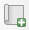
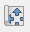
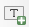

# Exercise 5: Print layout

## Exercise content

This exercise focuses on QGIS' print layouts and the map atlas functionality.

## The goal of the exercise

You know how to produce a print layout. You also know how to export print layouts as PDF files.

## Preparations

Open the previous QGIS project with visualized New York population data and add the following datasets to your project.

-   **..course_directory/ny_gov/ny_districts.gpkg**

-   **A background map of your liking, for example Browser \> XYZ Tiles \> OpenStreetMap**

## Print layout
 You can also customize the visual style of the **OpenStreetMap** background map if you want to. Your map could look something like this now:

{width="500"}

Now we can start working with the **print layout**. A new print layout can be opened by either selecting **Project \> New Print Layout** or clicking the **New Print Layout**  icon. You can manage your layouts in the project with the **Layout Manager** . Create a new print layout and remember to name it descriptively. The print layout window opens. This window is  separate from the normal workspace of QGIS and it has its own set of tools meant for composing map layouts and prints. Let's first set the properties of the page. Right-click the empty page and select **Page Properties**. From the right side of the screen, select the **Item Properties** taband set the page size to **A4** and orientation to **Landscape**. Then select the **Layout** tab and make sure that the export resolution is **300 dpi**.

{width="347"} {width="311"}

The preliminary configuration of our layout is now done. Let's add the map to our layout as our first component. In the left side toolbar, click the **Add Map** tool. Click and drag a rectangle on the empty page and the map will be drawn within the area.

{width="469"}

Then choose the **Select/Move item** tool  from the left toolbar and activate the map by clicking it. Select the **Item properties** tab and set parameters as follows:

-   Map scale 1:400 000

-   Activate the **Frame** option to frame the map

 

Move the contents of the map with the **Move item content** tool . The map item must be activated for the **Move item content** tool to work.Your layout should look something like this:

{width="401"}

Find the listing of important print layout tools below:

|                                 |                                                         |
|------------------|------------------------------------------------------|
|  | Select/move item                                        |
|  | Move item content (for example the content of the map). |
|  | Zoom the layout view.                                   |

Let's now add a headline to our map with the **Add label** tool . You can edit the label properties from the **Item properties** tab with tools familiar from most text editors. Set the text's horizontal and vertical alignment to **center** and **middle**. You can customize the label item more if you wish.

 

Next add a legend to your layout with the **Add Legend** tool . You might notice that the automatically generated legend lists all layers in your QGIS workspace - original, not-so- pleasant-to-look-at layer names included.

{width="446"}

Activate the legend by clicking it and navigate to **Item Properties \>** **Legend Items**. Uncheck the **Auto update** box to enable the editing of the legend items. Check the box **Only show items inside linked map** to only add items visible on the map to the legend. Right-click the **population_ny** and check the **Hidden** box to hide the layer name from the legend. Do this for the other layers as well.

::: hint-box
Psst! You can also remove legend items with the red minus symbol below the legend item list.
:::

Now the legend should look more pleasing. Let's add a title for the legend from the **Main Properties**. You can customize the legend even more with the **Fonts and text formatting**, **Symbol**,and **spacing options**. Also set a frame similar to that of the map item.

{width="484"}

Add a scale bar to your layout with the **Add Scalebar** tool . Activate the scalebar and head to the  **Item properties** to customize it. Set the **Style** to **Line Ticks Up**. Experiment with the other options as well.

Let's finish our print layout by adding a **north arrow** . Nowadays north arrows are mandatory only when the north of the map is not directly upwards. In **Item Properties \> Image rotation**, synchronize your north arrow to your map by checking the **Sync with map** box. If you rotate the map, the north arrow will now follow along.

You can also add a north arrow (or any kind of symbol) to the layout with the **Add picture** tool . Click and drag your desired area on the map and see what kinds of symbols are available by navigating to **Item properties \> Picture**.Select a north arrow you like (scroll down) and visualize it to your liking.

Your finished map layout could look like this, for example:

{width="486"}

You can also save your print layout for future use by selecting **Save as template** . You could for example format a standardized print template for your organization (logos, colors, text positions\...). You can export your finished print layout as a picture (PNG/JPEG), a vector shape (SVG), a digital print (PDF), or send it to a physical printer for printing.

You can export your print layout to the course directory if you wish. The optimal resolution of your map (dpi value) depends on the use case, but the default 300 dpi is usually enough.

::: hint-box
Psst! You can add symbols to your expressions with the buttons below the expression field. Similarly, you can add fields to your expression by expanding the fields and values list and double-clicking the field names.
:::

## Bonus: Map atlas

The **map atlas** is a functionality that allows us to automatically produce a large number of maps on the same theme. In the following example we will be producing a map atlas of the districts of New York to see how the population is distributed on district level. Our goal is to produce a total of 71 maps, one for every district. Set the **ny_districts** layer visible together with the **population_ny** and **OpenStreetMap** layers. Set the **ny_districts** layer on top of the two other layers and visualize it with a transparent fill and a visible outline.

{width="356"}

Create a new print layout. Add a new map item that has all three layers visible. Add a title, a legend, a scale bar and other cartographic or graphic items (such as a logo or a north arrow) that you'd like to the map. Set the scale of the map so that it can fit about one district (for example 1:130 000) because in the result the atlas features are automatically sized based on the sizes of the districts. Your print layout should look something like this at this point:

{width="483"}

Let's begin producing the map atlas. The map atlas functionality must be activated first before it can be used in the print layout window. From the top menu select **Atlas \> Atlas settings**. The atlas tab appears on the right side of the window. In the atlas tab, check the **Generate an atlas** box. Set the **Coverage layer** to be the layer with the regions on which the map is based on - in this case that would be the **ny_districts** layer.

{width="401"}

Make sure that the map item is activated, if it is not, activate it by clicking on it with the **Select/Move item** toolfound in the left toolbar. From the **Item Properties** select **Controlled by Atlas**.

{width="401"}

With the **Clipping settings**  You can select which layers to clip to atlas features. Clipping all layers results in nothing but the selected district being visible in the atlas, while leaving the background unclipped gives more context to the map.

{width="582"}

You can view your atlas by selecting **Atlas \> Preview atlas** in the top menu bar. You can use the preview to monitor what the atlas looks like while you are making changes. Use the arrows in the preview toolbar up top to move between atlas pages. Notice that you can edit the print layout and the map while simultaneously seeing the results update live in the preview.

Lets add an **index map** to our print layout by selecting the **Add Map** tooland adding a smaller map item next to our main map. The index map acts as an overview and shows us where the map atlas is focused. Activate the index map item and navigate to **Item properties \> Overviews** and add an overview with the plus sign. Configure the settings as follows:

If you want, you can try editing the index map's **frame style**. Also try switching pages in the atlas preview and notice how the frame of the index map follows the main map. Once you are done, you can print the map atlas with the **Export atlas** tool. Notice that every page of the atlas must be drawn when exporting - this may take a bit of time.

You can export your atlas either as separate images or as a single PDF file. Exporting as a single file can be done by navigating to the **Atlas** tab and enabling the **Single file export when possible** option.

{width="405"}

A page of the finished map atlas could look like this, for example:

{width="468"}

Notice how the index map is automatically updated for every page of the atlas.

Once you are done, save the project file into the course directory either by selecting **Project \> Save** from the menu bar or by pressing **CTRL + S**.
