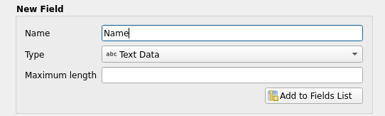
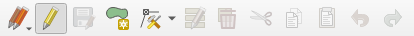

# Exercise 6: Editing geographic data sets

## Exercise content

In this exercise you will be creating a geographic data set and digitizing features based on aerial photos.

## The goal of the exercise

After the exercise you can create a geographic data set and know how to edit it.

## Preparations

Open a new QGIS project (**Project \> New**) and save it as **\"QGIS-exercise 8\"**. Add the following data to the project:

-   **..course_directory/swisstopo/orthophoto.tif**

::: hint-box
Psst! Remember to always check that your data and project are in the correct coordinate reference system (CRS)! In this case that would be the swiss standard CRS: CH1903+ / lv95 (EPSG:2056)
:::

## Creating a vector data set

Let\'s create a new GeoPackage data set by selecting **Layer \> Create Layer \> New GeoPackage Layer**. A dialog box for setting up your new data set opens. It is possible that there is already a GeoPackage data set in the **Database** field. Although it would be possible to add another layer to this pre-existing data set, we will be creating a completely new GeoPackage. Press the **\"\...\"-button** next to the **Database** field and save your new GeoPackage to your course directory as \"**Polygons**\". Then give a name, for example \"**Polygons**\", for the new layer and make sure **Geometry type** is set to **Polygon**. Set the CRS to **CH1903+ / LV95 (EPSG:2056)**.

Let\'s now, in the same window, add a few fields to the attribute table of our new **Polygons** data set. When a new field is created you must at least specify a **Name** and **Type** for it. You can also set a maximum length for the field (= how many characters the field can store). Let\'s first add a **Text** field called **\"Name\"**. Add the field to your data set by selecting **Add to Fields List**. Your new field should now appear in the field list of the **Polygons** data set.

 

Press **OK**. A new and so far empty **Polygons** dat set is added to the GeoPackageand a new vector layer named **Polygons** appears in the **Layers Panel** of your **QGIS** workspace. Open the attribute table of your new data set and make sure it is empty. There should only be two fields in the attribute table: **fid** ja **Name**. QGIS generates the fid field automatically and it functions as an unique numerical identifier for the features of the layer. The **Name** field is the one we just configured when adding a field to our data set.

## Editing and digitizing vector data

Now select an area you wish to edit. We will be digitizing buildings, forests and fields. Zoom close enough so that you can see these area types clearly.

Next select **View \> Toolbars \> Snapping Toolbar** from the top menu bar. The snapping toolbar should now be visible:

Click the **magnet** icon to enable snapping. After this click the icon to the right of the magnet icon and choose **Open Snapping Options**. Configure the options as shown in the picture below. Let\'s limit the snapping only to the active layer, snap both to edges and vertices in a 5 meter radius and also enable topological editing. Let\'s also enable the **Avoid Overlap on Active Layer** option. After you have set the options, you can close the **Snapping Settings** window.

Let\'s start editing the layer by clicking the **Toggle editing** tool . Notice that this activates the other tools in the **Digitizing Toolbar** too.

Select the **Add Polygon Feature** tooland start digitizing. Left-clicking sets the corner points for the polygon and right-clicking (once all the corners have been digitized) creates a polygon from the corner points. Now try digitizing a field area, for example:

Once you create the polygon a window for filling in the attribute information opens. Fill in the **Name** field (for example Field) and press **OK**.

We have now digitized our first map feature!

## Adding geometries

Let\'s digitize another feature. Notice that when you move your cursor within 5 meters of a digitized polygon (either the edges or vertices) QGIS snaps your cursor to it. Digitize a new area next to the previous polygon. Notice that the common edge between the polygons can be hard to follow. This could lead to unintended overlapping polygons, and is the reason why earlier we enabled the **Avoid Overlap on Active Layer** option in the **Snapping Settings**.

This setting makes digitizing much easier because you don\'t have to avoid digitizing polygons on top of each other. Try digitizing a few new polygons. Every time you want the polygons to have a common edge, just digitize inside the other polygon and QGIS will automatically delete the overlap. In the example a polygon overlaps with another polygon. Once the new polygon has been created, QGIS automatically deletes the overlap.

.

Digitize a few polygons more and then save your edits with the **Current Edits** tool 

Once you have digitized 5-8 new polygons, exit the editing mode by clicking the **pencil** icon. Save your edits and configure the symbology settings for the digitized layer. The **Categorized** option could work,for example. Below is an exemplary picture of a digitized area, but feel free to choose any area you like:

## Bonus: Adding attribute information

Next we\'ll add the areas of the digitized polygons as attribute information to the layer. Open the attribute table of the **Polygons** layer. Toggle editing on. First try editing the contents of the **Name** fields by double-clicking them. Notice that editing is only possible when the editing mode is toggled on. Now open the **Field Calculator**. This functionality allows us to either create new or update pre-existing fields of the attribute table. To calculate the areas of the polygons, configure the field calculator as follows:

The expression uses the automatic area function **\$area** that returns the area of a polygon as square meters. If you have digitized large areas, you can divide the result with a million to get square kilometers instead. Press **OK** to calculate the area of each polygon into its own field:

We can fine-tune the same expression further by using the **round** function to round our values with the desired precision. The function takes the value as the first parameter (area in this case) and the number of decimal places as the second parameter. The below example rounds the values to two decimal places.

Once you are done, save the project file into the course directory either by selecting **Project \> Save** from the menu bar or by pressing **CTRL + S**.
