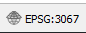
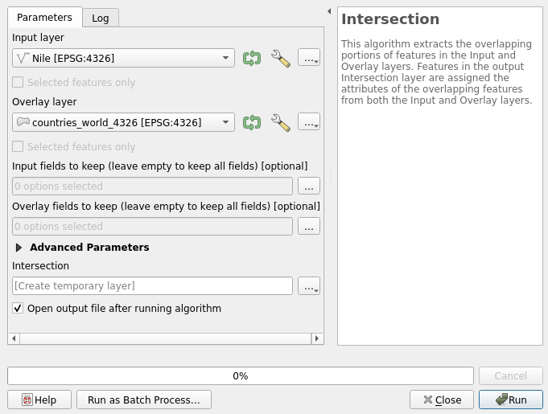
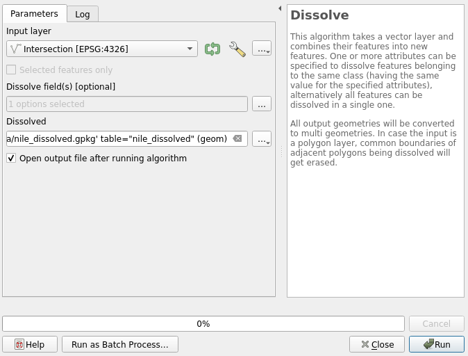
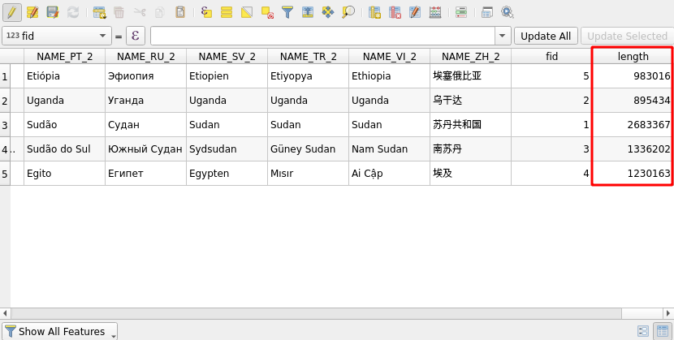

# Exercise 7: Spatial analyses

## Exercise content

This exercise focuses on simple spatial analyses with QGIS.

## The goal of the exercise

After the exercise you have basic knowledge about spatial analyses using QGIS.

## Preparations

Open a new QGIS project (**Project \> New**) and save it as **\"QGIS-exercise 7\"**. Add the following data to the project:

-   **..course_directory/natural_earth/rivers_world.shp**

-   **..course_directory/natural_earth/countries_world.shp**

The map view should look like this:

Make sure that the CRS is set to **WGS 84 (EPSG:4326)**. You can check/change your project's coordinate reference system (CRS) either by selecting **Project \> Properties \> CRS**) or by clicking the CRS button in the bottom left of QGIS:

Both methods open the project CRS window.

You can add data in multiple different coordinate reference systems to a single project, but **many of the analysis tools produce false results or completely stop working** if the data sets being analyzed are in different coordinate reference systems. In these cases the data must be exported to a common CRS. This time both data sets are in the same CRS (EPSG:4326), so we won\'t have problems.

## Vector analyses

In this exercise our goal is to find out the countries through which the river Nile runs. In a nutshell, the exercise follows these steps:

1.  We select the river Nile from the river data.

2.  We do a spatial analysis with the rivers and countries data sets. In the analysis the river data set gets feature information from the country data set.

3.  We dissolve the river sections by country name.

Duplicate the **rivers_world** layer by right-clicking and selecting **Duplicate Layer**.Open the properties of the new **rivers_world copy** layer by double-clicking the layer. Select the Source tab and set the layer name as **Nile**. Let\'s now filter the layer features, or, in other words, select which features we want displayed. Right-click the **Nile** layer and select **Filter\...**. Form the following expression into the **Provide specific filter expression** field:

::: code-box
"name_en" = 'Nile' OR "name_en" = 'White Nile' OR "name_en" = 'Blue Nile'
:::

You can access field names easily by double clicking them in the **Field** section. Visualize the new layer with new symbology settings so that it stands out from the other rivers.

Let\'s now perform an **intersection** analysis with the **Nile** and **countries_world** layers. From the top menu bar choose **Vector \> Geoprocessing tools \> Intersection**. The intersection window opens. Set **Nile** as the input layer and **counties_world** as the overlay layer.

Run the analysis by pressing **Run** and after that press **Close**. A new temporary layer is created. In the map view the temporary layer looks just like the original layer.

::: hint-box
Compare the attribute tables of the original Nile layer and the temporary intersection layer. What do you notice?
:::

Classify the data based on country names using the field **SOVEREIGNT** (**Properties \> Symbology \> Categorized**). Activate the **Show Feature Count** option (Right-click the layer in the **Layers Panel**). The classification in the layers panel should now look something like the image below (Colors and line width are of course different):

Next we can combine the separate road lines with the **Dissolve** tool. Select **Vector \>  Geoprocessing tools \> Dissolve**. Dissolve the **Intersection** layerby country name. Set the Intersection layer as **Input layer** and select the dissolve field (**SOVEREIGNT**) by clicking the button next to **Dissolve field(s)**. Save the results to for example your course directory and name the result descriptively (for example nile_dissolved.gpkg).  Now press **Run** and then **Close**. 

You can easily copy a pre-configured layer style for a new layer. Right click the layer with the style you want to copy (intersection) and select **Styles \> Copy style \> All style categories**. Then right click the layer we just created and select **Styles \> Paste style \> All style categories**.

Once you enable the **Show Feature Count** the result should look like this:

To top our analysis off we can calculate how much of the length of the Nile each country has. Let\'s start by calculating the length for every dissolved line. Open the attribute table, enable editing (with the pencil icon) and open the field calculator. Select **Create a new field**, and name it as length. Now calculate the lengths with the **\$length** function found in the **Geometry** section. Set the field length to integer so we get the lengths with 1 meter precision.

You can view statistical information about your layers with the **Statistical Summary Panel** (click the **Show Statistical Summary**  button in the top toolbar). Select the layer you want to examine (nile_dissolved in this case), and from the drop-down below menu select the **length** field. The panel displays useful information about the selected field, such as the feature count and the min, max and mean values.

Finally, let\'s calculate how many percentages of Nile each country has. Open the **Field calculator**  once again, select **Create new field** and calculate the percentage values as follows:

::: code-box
"length"/sum("length") \* 100
:::

Since we are using the **sum()** function instead of the absolute value, our percentages would change automatically if the lengths changed.

Once you are done, save the project file into the course directory either by selecting **Project \> Save** from the menu bar or by pressing **CTRL + S**.
