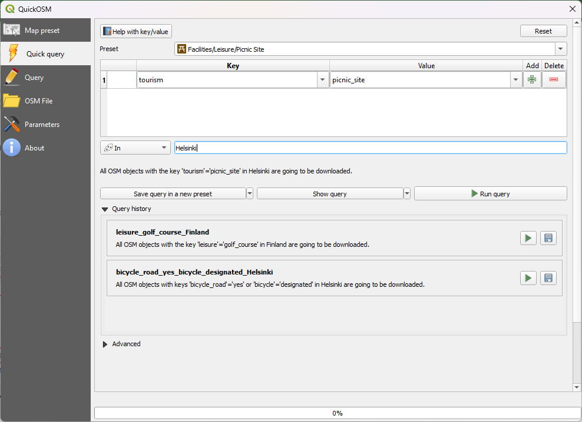
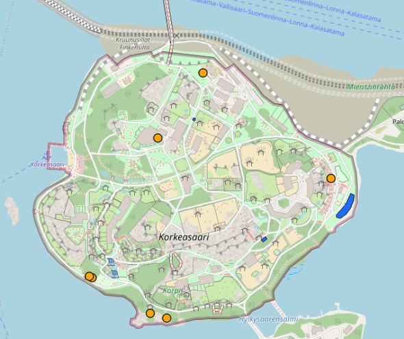
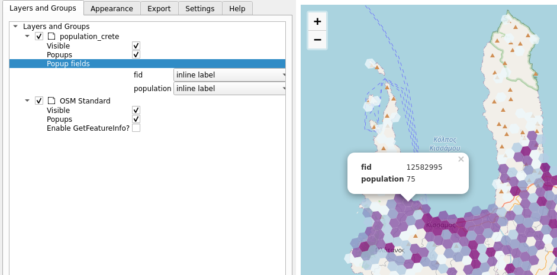

# Exercise 8: Plugins in QGIS

## Exercise content

This exercise familiarizes you with QGIS' diverse selection of plugins and focuses more closely on a few of the central ones.

## The goal of the exercise

After the exercise you understand the basics of QGIS' plugins and know how to use them.

## Preparations

Open a new QGIS project (**Project \> New**) and save it as **\"QGIS-exercise 10\"**. Add the following data to the project:

-   **..course_directory/kontur/population_crete**

## Plugin management

You can add plugins to QGIS from the top menu bar by selecting **Plugins \> Manage and Install Plugins...**. Choose the **Installed** tabto see all of your installed plugins. Notice that most of them are not activated. Activating plugins adds different toolbars and menus to QGIS, which is why it is best to leave unused plugins deactivated.

## QuickMapServices

**QuickMapServices** is a plugin for adding different online basemaps (Such as OpenStreetMap) to your projects. Select **Plugins \> Manage and Install Plugins... \> All** and search for QuickMapServices:

Click **Install Plugin** and then **Close**. A new menu under **Web** (in the top bar) has appeared. Select **Web \> QuickMapServices \> OSM \> OSM Standard**. OpenStreetMap is now visible in your project. Arrange your layers so that the population data is clearly visible. Try other background maps too. 

## QuickOSM

Find and add QuickOSM. With this plugin you can search and add objects from OpenStreetMap as a vector layer. Open **Vector → QuickOSM → QuickOSM**. In th e QuickOSM window you can find  objects with **Key** and **Value** or use **Preset**. For example lets find all the picnic areas in Helsinki, Finland. Start writing **picnic** in the Preset search and click on the Picnic-sites. The key and value of the search are automatically filled. Then add city we are interested in, this time Helsinki and click **Run query**

Two new temporary layers should appear to your Layers panel: point and area layers. You can visualize and use them in analyses if needed. If you want to save the layers for later use, **click the layer → Export → Save features as**. 

Try to add some other features from OpenStreetmap! For example add golfcourses or biking lanes from some city. If there isn't a suitable preset try to use key and value to find the feature.

## Bonus: Qgis2threejs

Now add the **Qgis2threejs** plugin. This plugin brings simple, browser compatible 3d visualization capabilities to QGIS (built on the threejs library). This plugin will also be accessed through the **Web** menu. Open the **Qgis2threejs Exporter** and from the **DEM Layer** menu select **Flat Plane**. Then, in the **Polygon** section, choosethe population data set and double-click it to open its settings. Set the **Z-coordinate Mode** to **Absolute** and **Height** tothe **population** field.

You can preview the 3d model in the exporter window and, if you'd like, export it as an HTML file by selecting **File \> Export to web**.

## Bonus: Qgis2web

The **Qgis2web** plugin is an easy to use plugin for creating web maps using the **Leaflet** and **OpenLayers** libraries. Qgis2web is a useful tool for learning these libraries and producing content for publishing on the web. Open Qgis2web from **Web \> Qgis2web \> Create web map**. Under the **Popup fields** section, choose the **Inline label** option for the fields of the population layer and press **Update preview**. Once the map has updated, click on the population grid. If no popup is visible, try switching to **Leaflet** (from the bottom of the window) and updating the preview.

Now switch to the **Appearance** tab and configure the settings as shown below:

Export your map by selecting **Export**.This functionality saves the map as an HTML file that automatically opens up in a browser window. Zoom around your web map and try out the features: click on the grid, measure distances and search for  addresses (try searching for Crete's capital, Heraklion, for example)
